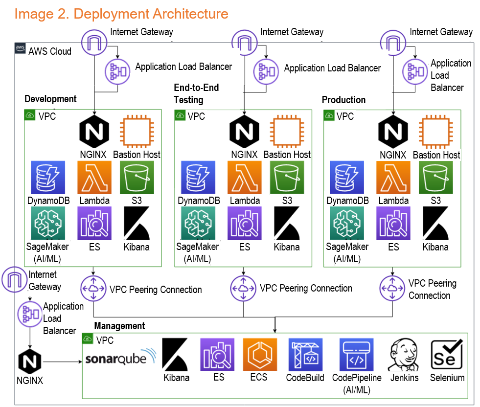
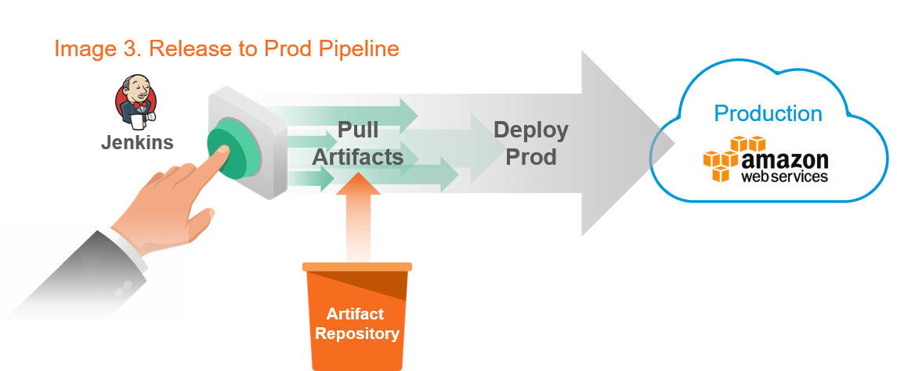

[](https://pyramidsystems.com)

Pyramid Systems, on behalf of ACME Corporation, has developed a movie plot comparison tool that discovers and analyzes data to enable employees at ACME to compare movie plots for their unique movie production. 

# Deployment Instructions

## Steps to Run the Solution

To deploy the application to an AWS account, perform the following steps:

1. Ensure the following prerequisites are installed and present:
    * [AWS CLI](https://aws.amazon.com/cli), current version
    * [NodeJS](https://nodejs.org/en) version 10.x or later
    * [Git](https://git-scm.com/), with this repository cloned to a local folder
    * AWS security credentials with administrator privileges to your account (access key ID and secret access key) in the `us-east-1` region, which can be verified by running `aws configure`. You may need to create these keys using your admin account in AWS IAM.
    * Recommend running the script against a virgin AWS environment to ensure there are no conflicts or limit issues
2. Run the deployment script:
    * Open a terminal and navigate to the repo's local folder (such as `./{{.projectName}}`)
    * Run `{{.projectName}}.sh -d` (from a Linux, Mac or Windows box that has either gitbash or Windows Subsystem for Linux)
    * You will be prompted for the following
    * GitHub Username - IRNSDD-Demo3
    * GitHub Password - <your password>
    * Project Name - <Please enter `{{.projectName}}`>
    * Wait for the script to complete. This could take more than 2 hours to complete as it will provision three different environments
    * Record any URLs, credentials, and keys provided by the script. You will need these to inspect and maintain the application.

The deployment script will 
* Launch a local browser to view the logs of the provisioning process
* Kick-off a Jenkins build and print the URLs in the browser window
Please copy the URLs and close the browser window and do not refresh the browser window. Please monitor the Jenkins build ( https://jenkins.{{.projectName}}.pac.pyramidchallenges.com login:pyramid, password:systems) and after the job completes, browse to the production URLs to access the application, also provided below. Please do not refresh 

See [Steps to Teardown](#steps-to-teardown) below for instructions on how to tear down the solution, and [Deployment Script Explanation](#deployment-explanation) for a full description of how our 100% automated deployment script sets up our infrastructure and CI/CD pipeline.

## Accessing the Application

The deployment script will provide links to access the application at the end of execution. If the government used the default project name `{{.projectName}}`, it should be accessible from the following links. You can replace `{{.projectName}}` with the specific project name to access the applications. Even if the deployment partially fails, we recommend the government to try accessing the applications through the following links 

### Environments
  * Integration: https://integration.{{.projectName}}.pac.pyramidchallenges.com
  * Staging: https://staging.{{.projectName}}.pac.pyramidchallenges.com
  * Production: https://production.{{.projectName}}.pac.pyramidchallenges.com

### Supporting Tools
  * Jenkins: https://jenkins.{{.projectName}}.pac.pyramidchallenges.com
  * SonarQube: https://sonarqube.{{.projectName}}.pac.pyramidchallenges.com/dashboard?id=app
  * Selenium: https://selenium.{{.projectName}}.pac.pyramidchallenges.com
  * Kibana: https://monitoring.{{.projectName}}.pac.pyramidchallenges.com/_plugin/kibana

Use a login of 'pyramid' and password of 'systems' to access Jenkins and Kibana.

In the event, the above links are not accessible, we recommend trying the following links to access the application, test suites, and pipeline in the *Pyramid Systems* AWS environment. 

### Environments
  * Integration: https://integration.qwerty.pac.pyramidchallenges.com
  * Staging: https://staging.qwerty.pac.pyramidchallenges.com
  * Production: https://production.qwerty.pac.pyramidchallenges.com

### Supporting Tools
  * Jenkins: https://jenkins.qwerty.pac.pyramidchallenges.com
  * SonarQube: https://sonarqube.qwerty.pac.pyramidchallenges.com/dashboard?id=app
  * Selenium: https://selenium.qwerty.pac.pyramidchallenges.com
  * Kibana: https://monitoring.qwerty.pac.pyramidchallenges.com/_plugin/kibana

Use a login of 'pyramid' and password of 'systems' to access Jenkins and Kibana.


## Steps to Teardown

To tear down the application, assuming you have the same credentials and prerequisites required to run the deployment script, execute the following commands from your terminal window:

1. Open a terminal and navigate to `./{{.projectName}}`
2. Run `{{.projectName}}.sh -t` (from a Linux, Mac or Windows box that has either gitbash or Windows Subsystem for Linux)
3. You will be prompted for the Project Name which should be specified as `castr` or the name that was used during deploy

See [Teardown Explanation](#teardown-explanation) for a discussion of the teardown script.

## Deployment Script Explanation

This application is configured to automate the provisioning of and deployment to an [Amazon Web Services](https://aws.amazon.com) infrastructure. This infrastructure complies with NIST 800-53 controls and FISMA requirements. All services are either FedRAMP certified or currently undergoing Joint Authorization Board (JAB) review for FedRAMP certification.

This deployment script creates the full ecosystem in AWS that includes four VPCs: three application VPCs (one for each environment: integration, staging, and production) and a management VPC that controls and manages all of those environments. The script also configures the required AWS resources, instances, network configurations, and security groups.

The script automatically performs the following steps to accomplish this task:

* Prompt for user inputs: User confirmation of configuration values
* Create an AWS EC2 instance using a pre-built, public AMI (Amazon Machine Image) that has all the software in the proper versions needed to run the application.
* Randomly generate and store secure secrets in an AWS Systems Manager [Parameter Store](https://us-east-1.console.aws.amazon.com/systems-manager/parameters), to be used in the Docker images.
* Build fresh Docker images from scratch, using the `Dockerfile`s from `/{{.projectName}}/deploy/docker-images/`, to be uploaded to AWS [Elastic Container Repository](https://us-east-1.console.aws.amazon.com/ecr/repositories) (ECR).
* Upload images to AWS ECR, to support the Management [Virtual Private Cloud](https://console.aws.amazon.com/vpc) (VPC) and the AI/ML pipeline.
* Create encryption keys from AWS [Key Management Service](https://console.aws.amazon.com/kms) (KMS), to secure Terraform using the AWS Software Development Kit (SDK).
* Create the AWS [Simple Storage Service](https://s3.console.aws.amazon.com/s3) (S3) bucket that will house the Terraform state, to track information about infrastructure resources deployed to AWS.
* Provision the DNS records for the application in AWS [Route53](https://console.aws.amazon.com/route53) and an SSL certificate though AWS [Certificate Manager](https://console.aws.amazon.com/acm) (ACM), using a Terraform lifecycle.
* Create non-region-specific cloud resources, including Jenkins, SonarQube, and Selenium Hub. This includes configuration of resources and services in AWS including [CloudWatch](https://console.aws.amazon.com/cloudwatch), VPC, [Identity and Access Management](https://console.aws.amazon.com/iam) (IAM), [Elastic Container Service](https://console.aws.amazon.com/ecs) (ECS), Load Balancer, and [Elastic Compute Cloud](https://console.aws.amazon.com/ec2) (EC2).
* Add Jenkins pipelines to the Jenkins server in the Management VPC.
* Run the End-to-End CI/CD pipeline by starting a Jenkins build using the Jenkins Command Line Interface (CLI). This builds the project and deploys the build artifacts to the Integration environment (`integration`) through a Terraform lifecycle. If all automated tests run successfully, it deploys the same build artifacts to the Staging environment (`staging`) through a Terraform lifecycle. This pipeline will set up the contents of each environment's VPC, including S3 buckets, [Lambda](https://aws.amazon.com/lambda/) functions, [DynamoDB](https://aws.amazon.com/dynamodb/), [Elasticsearch Service](https://aws.amazon.com/elasticsearch-service/), and [SageMaker](https://aws.amazon.com/sagemaker/).
* Run the Production CI/CD pipeline by starting a Jenkins build using the Jenkins CLI. This uses the build artifacts already deployed to the Non-Prod environments to deploy to the Production environment through a Terraform lifecycle.
* Confirm the deployment and display all the URLs, usernames, passwords, and keys needed to run and inspect the application.
* Shut down the AWS EC2 instance on which the bulk of the deployment script was carried out.

## Troubleshooting Deployment Failures
As the deployment is configuring multiple AWS services across three different environments, there are chances for the deployment script to fail due to timeouts, limits in the particular AWS environment, network connection drops and other unforeseen issues. Since we use Terraform to perform the automation, it is mostly idempotent and restartable. In the event of a deployment failure, the following actions are suggested for USCIS to consider in resolving the problem.

* If the deploy script should fail during the creation of management VPC, you will have to manually deprovision resources from the AWS Management Console and then start the deploy script again and use a different project name such as `castr1`
* If you hit issues with VPC or other limits, please request AWS Technical Support to increase those limits and re-execute the deploy script
* If there are some issues with that particular AWS account and if you would like to use a different account, then re-run the deployment script with a different project name such as `castr1` to avoid domain name collisions or conflicts
* Go to https://jenkins.{{.projectName}}.pac.pyramidchallenges.com and manually build the "deploy-script" job, if it failed at some stage
* Sometimes the Data Scientist or Product Owner view may not fully render the node graph for each role groups. If this should happen, please clear the browser cache by doing a `shift-refresh` on your browser. The preferred browser for testing is Chrome


## Teardown Explanation

The teardown script leverages Terraform scripts to automatically destroy the resources provisioned by the deployment script, essentially doing the deployment in reverse. Security resources such as the encryption keys in KMS, secrets in Parameter Store, and SSL certificate in ACM are not destroyed.

# Repository Hierarchy

```bash
├── app                 # ReactJS web application
├── assets              # Images and other static assets
├── core                # Core (auth, database) code
├── data-science        # Data science (AI/ML) code
├── docs                # Documentation of the solution
├── domain              # Model objects
├── integration-tests   # Serenity BDD test scripts
├── models              # Description of AI/ML models
├── services            # Microservices
├── terraform           # Terraform scripts
└── tools               # Internal dev tools
└── Approach.md         # Agile and Technical Approach
└── Scans.PDF           # OWASP Source Code Analysis Results
└── README.md           # This file
└── Jenkinsfile         # Jenkins Pipeline as Code
{{.projectName}}.sh          # Deployment and Teardown script
```

# Solution Description

## Single-Level Architecture Diagrams

The diagram below illustrates the overall concept of operations, data flow, and architecture of the system. For details of how each component functions and why we chose this approach, see [Supporting Documentation](#supporting-documentation).


# Sample Use Cases

## Review Relationships between Movies

**Actor:** Product Owner

**Basic Flow:** The product owner is looking for a unique plot for a movie, thus the product owner reviews the historic data to find movie plots that do not share much in common with other movies in the same genre.

**Core User Stories:** 1
# Solution Description

This coding submission includes three separate environments: integration, staging, and production. The environments' VPCs are controlled via a management VPC, which contains common deployment and monitoring tools. The diagram below illustrates the overall deployment architecture of the system.



## Core Technologies Used

This application is fully built on open source technologies. Like USCIS, Pyramid has adopted platforms and tools that are open source to maximize developer productivity and familiarity while streamling operations and reducing maintenance costs. 

* Infrastructure
    * [Terraform](https://www.terraform.io) for infrastructure automation
* Application Development
    * [Node.js](https://nodejs.org) and [Express](https://expressjs.org) for backend microservices
    * [ReactJS](https://reactjs.org) for frontend
    * [Redux](https://redux.js.org) for application state management
    * [Jupyter](https://jupyter.org) for AI/ML modeling
* Testing and Code Quality
    * [Jest](https://jestjs.io) and [Enzyme](https://airbnb.io/enzyme) for unit and component testing
    * [Serenity BDD](https://www.thucydides.info), [Selenium](https://www.seleniumhq.org/), and [Cucumber](https://cucumber.io) for automated acceptance and regression testing
    * [SonarQube](https://sonarqube.org) for continuous inspection of code quality
    * [ZAP](https://plugins.jenkins.io/zap) for automated cyber security OWASP scans
* Building and Deployment
    * [Webpack](https://webpack.js.org) for module bundling
    * [Gradle](https://gradle.org) for build automation
    * [Jenkins](https://jenkins.io) for continuous integration of the app pipeline
    * [CodePipeline](https://aws.amazon.com/codepipeline/) for continous integration of the ML and data pipelines 

## Instructions for Running from Code to Full Deployment

The deployment instructions provided earlier, will provision the application in a production environment

To start a build and full deployment without checking in new code
* Open a browser and navigate to the Jenkins server URL specified in the deployment script
* In Jenkins, start the `release-through-e2e-testing` build and on successful completion copy down the build number
* Navigate to `release-to-production` build and initiate it by clicking "Build with Parameters" and provide the build number

Once Jenkins indicates the build is successfully completed, navigate to the Production environment URL specified in the deployment script and run the CASTR web application.



## Stability & Fault Tolerance

We designed our overall application to be modular and horizontally scalable by adopting microservices, containers and serverless deployment models. The microservice approach enabled our team to develop, test and deploy each component separately without impacting the rest of the system. By deploying them as serverless autoscaling Lambda functions, we were able to assure consistently high uptime and fault tolerance. We extended the microservices philosophy to the front-end as well by developing the UI as a set of micro-front-end components. As our machine learning models are continually refined, our Lambda functions push only the updated data forward to the application, allowing rapid prototyping of changes made by data scientists as well as DevSecOps team members. We employed three environments in our application pipeline: Integration, Staging, and Production. This separation enabled progressive promotion of stable versions of the applications to higher order environments.

## Maintainability

We designed our AWS architecture to be modular and composable through Terraform automation. This enabled our team to quickly build out individual application environments and rebuild them through code if any defects or issues were discovered. Through our adoption of containers for deploying services such as Jenkins, Sonar and Selenium, we further simplified the maintenance and upkeep tasks for our management VPC components. We utilize SonarQube as a quality gate in our app pipeline to ensure code quality and test coverage achieve a high baseline prior to deploying to an environment. This mechanism ensures the system has an overall maintainability rating of 'A' (technical debt under 5%). The output of the data pipeline to ElasticSearch is monitored by Kibana.

## Monitoring

We implemented Elastic in the management VPC to enable operational monitoring of all application environments. Elastic aggregates all log streams and through [Kibana](https://www.elastic.co/products/kibana), we provide the ability to query and browse through an integrated view of log events and perform root cause analysis. 

## Scalability

Our serverless architecture leverages Lambda functions to push data from our data pipeline to a set of self-sufficient microservices. This architecture automatically scales to increased traffic or increased CPU load due to more complex data analysis.

Although this submission is restricted to a small data set, our AWS data storage solutions S3 for raw data, DynamoDB for processed data, and Elasticsearch Service for searchable data provide consistent, transparent scaling to larger data sets like those currently used by the Government.

To expedite development, our architecture includes a single application load balancer for each environment VPC, an EC2 instance running [nginx](https://www.nginx.com/). To scale several orders of magnitude past the constraints of this challenge, we would replace this piece with a more scalable solution such as AWS CloudFront.

## Security

At the lowest level, access to AWS services and resources are controlled via IAM users and roles. These IAM permissions adhere to the NIST 800-53 AC-6 Least Privilege control, giving authorized users access to only those privileges which are necessary to accomplish assigned tasks. All access to S3 and DynamoDB storage is restricted to endpoints in the VPC for each environment, limiting access to production data from Non-Prod environments.

Traffic is encrypted in transit using SSL/TLS 1.2. This security constraint is applied at all levels, including end user-to-application interfaces as well as application-to-application/backend interfaces. 

Security scans are conducted automatically as part of the app pipeline by the official OWASP Zed Attack Proxy (ZAP) Jenkins plugin, which proactively scans for potential vulnerabilities. In addition, we performed periodic [Fortify](https://www.microfocus.com/en-us/solutions/application-security) scans against our application, to reduce our application's attack surface and help ensure it is compliant with USCIS security policy.

## Microservices

Pyramid has designed this application with strict adherence to a microservice architecture and [The Twelve-Factor App](https://12factor.net) paradigm. This design approach enables us to deliver loosely-coupled services that concentrate very specific business capabilities into a single, independently deployable package. The development team has integrated these microservices into the larger application while continuously focusing on refactoring throughout the development cycle. For more detail about our approach, see [Approach.md](Approach.md).

The following microservices were developed for this coding submission:

| Microservice Name | Description |
| --- | --- |
| `movies` | The `movies` microservice handles accessing and reviewing data about historic movies. |

The API for microservices can be accessed with a URL in the format `https://<environment url>/api/<service>/<input>`, such as https://e2etesting.qwerty.pac.pyramidchallenges.com/api/role will return all roles.

# Supporting Documentation
1. [Agile Architecture and Technical Approach](Approach.md)
2. [AI/ML Models](models/Models.md)
3. [Solution Details and UX Design](docs/Solution.pdf)
4. [Git Commits and Pull Requests](docs/Commits.pdf)
5. [User Stories](docs/UserStories.pdf)
6. [Security Scans](Scans.pdf)
7. [Jupyter Notebook](data-science/notebooks/FinalConsolidated.ipynb)

## Instructions for Viewing Jupyter Notebooks

There are multiple ways to view and run the Jupyter notebooks which highlight aspects of our data science approach:

### Run Jupyter Locally

For users who have technical experience with Python and notebooks, the simplest approach is to run and view locally:

* Download and install [Anaconda](https://www.anaconda.com/distribution/#download-section) for Python 3.7+. Anaconda is the easiest way to get started with Python, and installs many dependencies including jupyter.
* Open a terminal window, navigate to the root directory of the repo `/{{.projectName}}`, and execute `jupyter lab` or `jupyter notebook` to start a notebook server.
* Once your browser starts the jupyter instance, navigate the project file structure to `{{.projectName}}/data-science/notebooks` to view and run the notebook.

### Access Jupyter on Amazon SageMaker

For general users who want to view the notebooks online, as part of the deployment script, a SageMaker notebook instance will be provisioned on your AWS environment. If you have credentials and access for this instance, navigate to the URL for the Final Consolidated Notebook - https://{{.projectName}}-notebook-instance.notebook.us-east-1.sagemaker.aws/notebooks/{{.projectName}}/data-science/notebooks/FinalConsolidated.ipynb If the deploy script was run with a different project name, replace `castr` in the URL with the right project name. Our Jupyter notebook is also available here - 
* https://qwerty-notebook-instance.notebook.us-east-1.sagemaker.aws/notebooks/{{.projectName}}/data-science/notebooks/FinalConsolidated.ipynb
* AWS Account Number:{{.awsID}}, login:sagemaker-user and password:pyramidsystems
